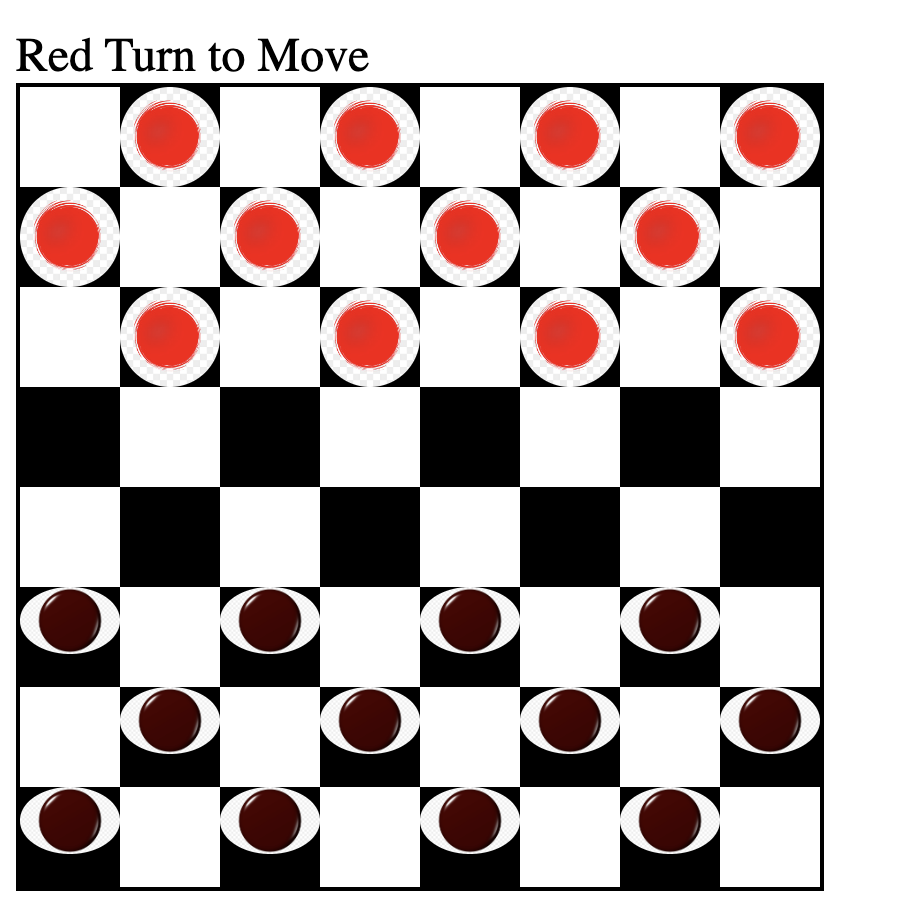

<h1>Checkers Game</h1>

<strong>Background</strong>: The oldest form of checkers was played around 3,000 B.C.E. It was found by archeologists in an ancient city called Ur in Iraq. Those who have studied the history of checkers have also found a game called Alquerque. It was played in ancient Egypt as far back as 1,400 B.C.E.

<h2>Technologies Used</h2>

HTML, JavaScript, CSS

<h2>Getting Start</h2>
The gmae need 2 players iterate each other to move piece on board. once 1 color of pieces eliminated, game is end and alert will show on screen 
<h2>Future Inhancement</h2>

 Add king function, let piece go end of other side, become a king piece

 Add continus beat function, if it works, it can eat couple pieces in same time

 Add logic if nothing can move, that side is lost game

Add AI let player can play with PC

Change piece in better imag

